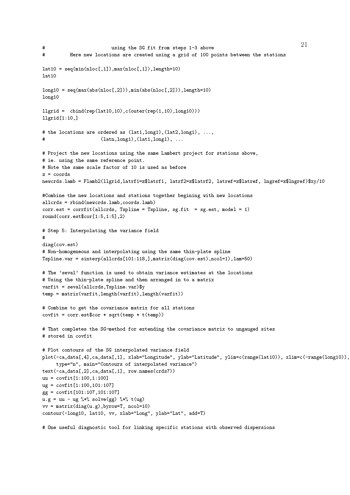

# Project1_3 

## Introduction

This exercise links with Exercise 14.16 in the text. It concerns temperature data.
The daily data for the project is found in two files:

1. The meta data: metadataCA.txt.  This file gives a number of sites, their elevations above sea level in feet, their geographic coordinates in latitude and longitude, and in two right hand most columns, a reference point's coordinates on the west coast of California linked to the site,  that can be used to learn the site's distance from the ocean.

2. The maximum daily temperature: MaxTempCalifornia.csv.  The maximum daily temperature in 1/10th of a degree Fahrenheit for those sites from Jan 1, 2012 to Dec 30, 2012. 

You may find it convenient to divide the year into different periods, not necessarily based on the ones traditionally used, for example you might divide 2012 into 13 ``months'' of 28 days each by dropping days at the end of the year. This is not compulsory, but you may find it makes your life easier. 

### The problems:

1.3(a).  Explore the data looking at such things as the need to transform it to achieve a Gaussian approximation. Briefly state your findings. 

1.3(b).  Compute ``monthly'' averages of the (possibly transformed) data at each site and their grand mean for each month.  Subtract the latter for each month from the site specific monthly averages for that month to get the residuals. In the report describe observed patterns in these residuals.  How well does the monthly overall mean explain the monthly averages. 

1.3(c).  Next subtract the monthly averages from the (possibly transformed) data. How well do the monthly averages capture the temperature trend (regular component of change) over the year. Report your conclusions.

1.3(d). Convert the geographic coordinates using the Lambert projection. You can find that function the CRAN library, but you will need to install an older version of R to run it.  There you will also get code for the Sampson -- Guttorp warping method as well as a demo based on data seen in Lab 4 for New York State. In these coordinates, Euclidean distance becomes a meaningful measure of separation for any two points.  Work through the Demo. (this part is to worked through on your own in order to answer the subsequent questions - nothing need be submitted)
 
1.3(e). Find the distance of each of the eleven sites from its reference site on the coast and enter the result into an augmented version of the metadata file as another explanatory variable for your analysis. (this part is to worked through on your own in order to answer the subsequent questions - nothing need be submitted)

1.3(f).  For any given day, that distance along with elevation and the (Lambert) location coordinates provide explanatory variables for  temperature.  Ignoring spatial correlation, find a  to the (possibly transformed) temperature data for Apr 1, 2012 and July 1, 2012.  Briefly state your conclusions for each day about such things as significant interactions and model fit, using the usual diagnostic tools.

1.3(g). For each of the two days above, compute the residuals from this fit at each of the sites.  Using standard geostatistical tools, determine if the random field of residuals is stationary.  If not apply the Sampson--Guttorp method to obtain a stationary variogram. Finally ``map'' the temperature field using a mapping tool like kriging on each of the two days. Show your map.

1.3(h). Now repeat the first part of (g) [\emph{for each of the two days above, compute the residuals from this fit at each of the sites}], but this time using the approach in the Demo, including the spatial prediction method given there. Compare the results of with those you found for (g).  Note that the 13 month model suggested above makes adaptation of the approach in the Demo (described in more detail in the LeZidekTutorial found in the resources folder) easier since you can adapt R codes in the demo to the extent possible. 

 
### Solutions for Project 1_3

{width=120%}
{width=120%}
{width=120%}
{width=120%}
{width=120%}
{width=120%}
{width=120%}
{width=120%}
{width=120%}
{width=120%}
{width=120%}
{width=120%}
{width=120%}
{width=120%}
{width=120%}
{width=120%}
{width=120%}
{width=120%}
{width=120%}
{width=120%}
{width=120%}
{width=120%}
{width=120%}
{width=120%}
{width=120%}
{width=120%}
{width=120%}
{width=120%}
{width=120%}
{width=120%}
{width=120%}
{width=120%}
