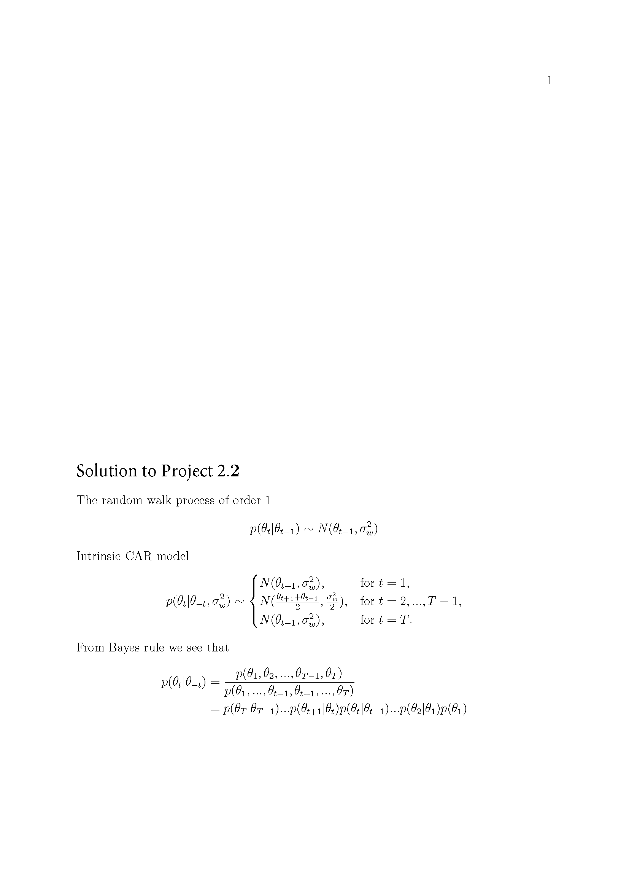

# Project2_2

## The problem

Show that a random walk process of order 1 can be expressed in terms of an intrinsic CAR model, i.e. if 
$p(\theta\_t| \theta\_{t-1}) \sim N(\theta\_{t-1}, \sigma^2\_w) $ then 

\begin{eqnarray} \nonumber
p(\theta\_t|\theta\_{-t},\sigma\_w^2) \sim \left\{ \begin{array}{ll}
N (\theta\_{t+1},\sigma\_w^2) &\mbox{for }t=1,\\ N \left(
\frac{\theta\_{t-1}+ \theta\_{t+1}}{2},\frac{\sigma\_w^2}{2} \right)
&\mbox{for } t=2,...,T-1,\\ N (\theta\_{t-1},\sigma\_w^2)&\mbox{for
}t=T. \end{array}\right.
\end{eqnarray}
where $\theta\_{-t}$ represents the vector of $\theta$'s with
$\theta\_t$ removed.\\
Pay particular attention to any assumptions that need to be made when $t=1$ and $t=T$.

 
## Solution for Project 2_2

{width=120%}

 

