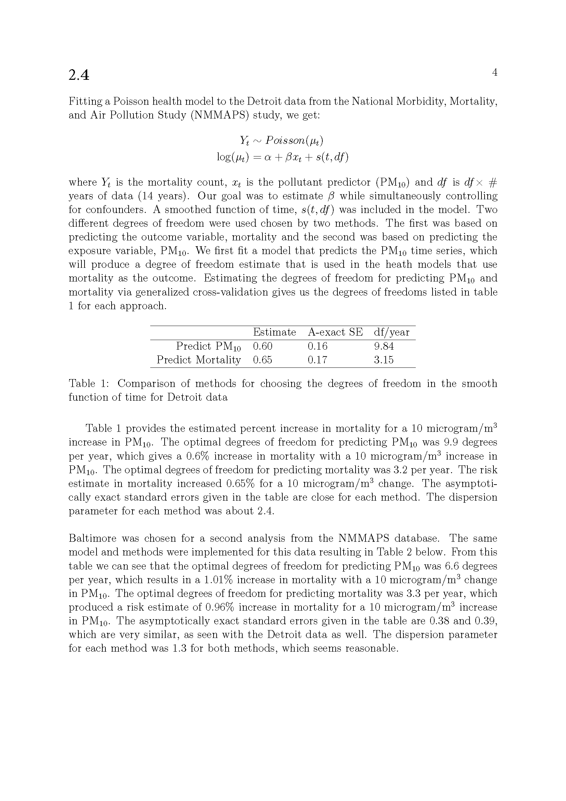
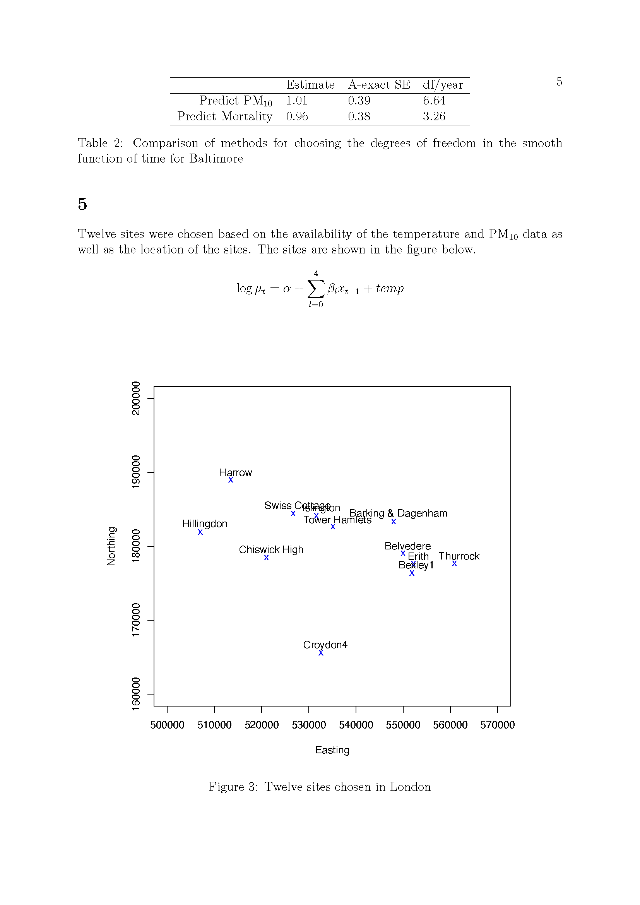
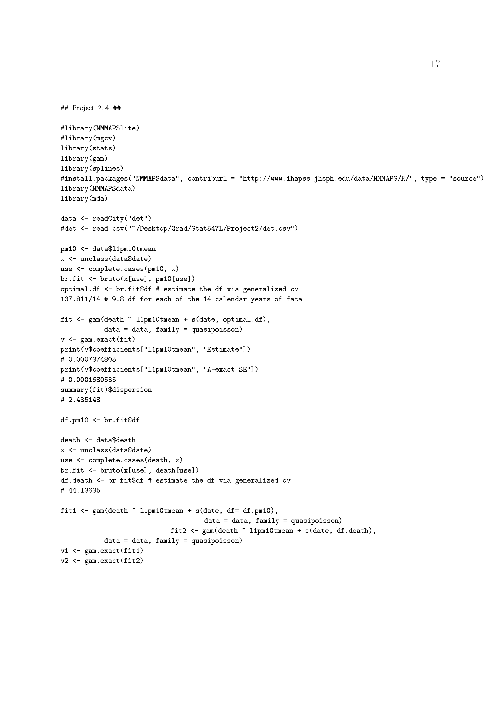
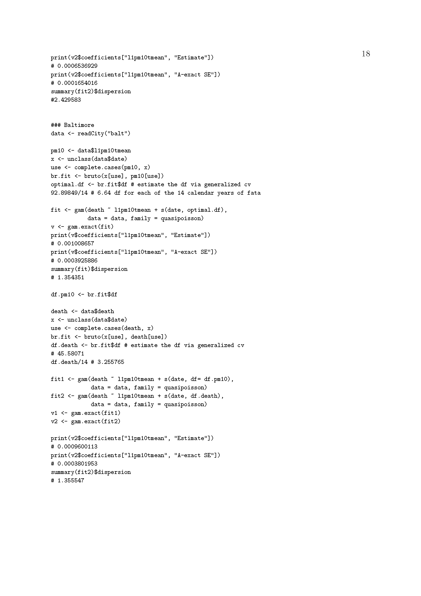

# Project 2_4

## Introduction

For this part, you will practice fitting a health model to time series epidemiological data. The book `Statistical Methods for Environmental Epidemiology with R' by Peng and Dominici (Springer, available electronically) provides a comprehensive study of these models based around using data from the National Morbidity, Mortality, and Air Pollution Study (NMMAPS) study. The data is available in an R package NMMAPSlite which you should install.

## The problems
You should read through Chapter 7 that concerns fitting the Poisson health models we have seen in class using R. You should work through the example for Detroit ensuring that you are comfortable with the use of splines for accounting for underlying patterns of seasonality and long-term changes in he health data.

Choose another city from the NMMAPS database (obtain the data from the NMMAPSlite package) and repeat the analysis. Present your findings in terms of relative risks (with confidence intervals) associated with changes in ten units of your chosen pollutant. 

## Solutions for Project 2.4

{width=120%}
{width=120%}
{width=120%}
{width=120%}
{width=120%}

