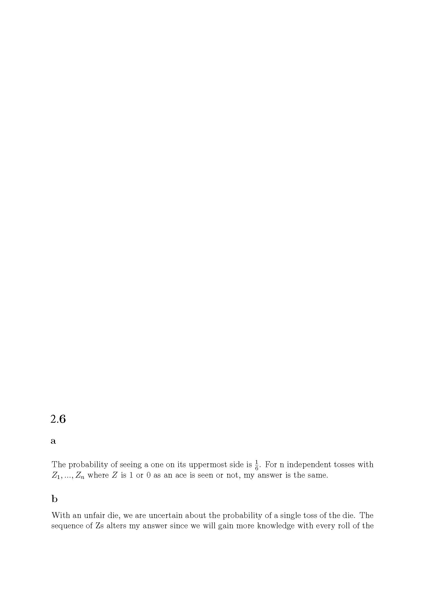
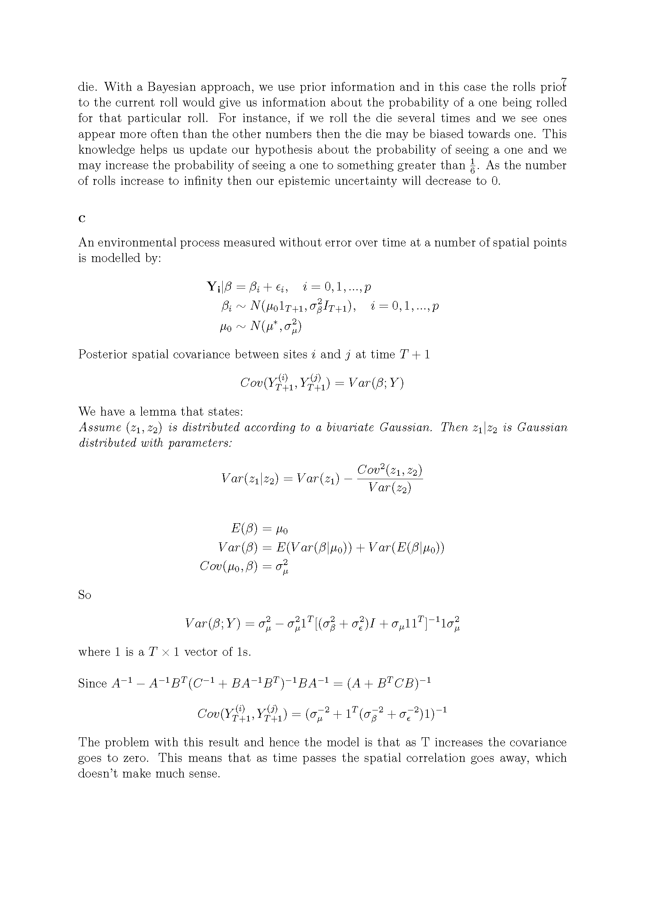

# Project 2_6

## Introduction

Probability has been called the language of uncertainty. In other words uncertainty about an event's outcome can be characterized as the probability of its occurrence.  This idea is enshrined in statistics through the Bayesian paradigm where all uncertain quantities turn into random variables with a probability distributions. However, in other contexts, uncertainty is not regarded as quite so simple. Commonly it isdichotomized as being either ``aleatory'' (pure chance) or ``epistemic'' (due to lack of knowledge). In the latter case, additional knowledge will change that state of uncertainty.

## The problems
2.6(a).  A perfectly balanced six sided conventional die is to be tossed. What is the probability of seeing an ``ace'' (one) on its uppermost side?  Suppose n independent tosses of the die yield $Z\_1,\dots,Z\_n$ where $Z$ is $1$ or $0$ according as an ace is seen or  not.  Could that infrormation change your answer?

2.6(b).   A new die is now used in this experiment with no assurance of its ``fairness'' but with knowledge that it has 6 faces numbered from 1 to 6 as before.  What would you now say about the probability of a ace on a single toss of that die?  Take a Bayesian approach and say how the sequence of $Z$s in this case might alter your answer to that question and your certainty about your answer.

2.6(c).  So what has all this to do with spatial epidemiology? The answer lies in the way spatio-temporal processes are modeled within a Bayesian framework where the two types of uncertainty are not distinquished.  Consider the following example. An environmental process $\{Y\_{it},~i=1, \dots, p, ~t =1, \dots, T\}$ is measured without error over time $t$ at a number of spatial sites $p$ and modeled by:
\begin{eqnarray*}
\nonumber
Y\_{it}|\beta
&=&
\beta\_{it} + \epsilon\_{it}, ~i= 0, 1, \dots, p,~ t=1, \dots, T+1,~{\rm or}\\
\textbf{Y}\_{i}|\beta
&=&
\beta\_{i} +  \epsilon\_{i},~i=0,1,\dots,p,~{\rm with}\\
\beta\_{i}
&\sim&
{\rm N}(\mu\_0 {\rm 1}\_{T+1},\sigma^2\_\beta ~ {\rm I}\_{T+1}),~i=0,1,\dots,p\\
\mu\_0
&\sim&
N(\mu^*,\sigma^2\_\mu),
\end{eqnarray*}
	where the variances are known while the $\epsilon$'s are
		independent of one another. For parsimony, the model thus
	 puts all the spatial correlation into that of the $\beta$'s.
	Some of the randomness in the $\beta$'s might be due to chance,
	 such things as fluctuations in temperature or wind direction.
	This randomness and hence uncertainty about the coefficients would
	thus be aleatory. But some of their uncertainty would be due to their
	 unknown baseline level $\mu\_0$ and would be epistemic.

	2.6c(i). Compute the posterior spatial covariance between sites at time $T+1$
	
	2.6c(ii). What is wrong with this result and hence the model as $T$ increases?
	
	2.6c(iii). How might this model be fixed to overcome the difficulty in (ii)?
	

## Solutions for Project 2.6

{width=120%}
{width=120%}

