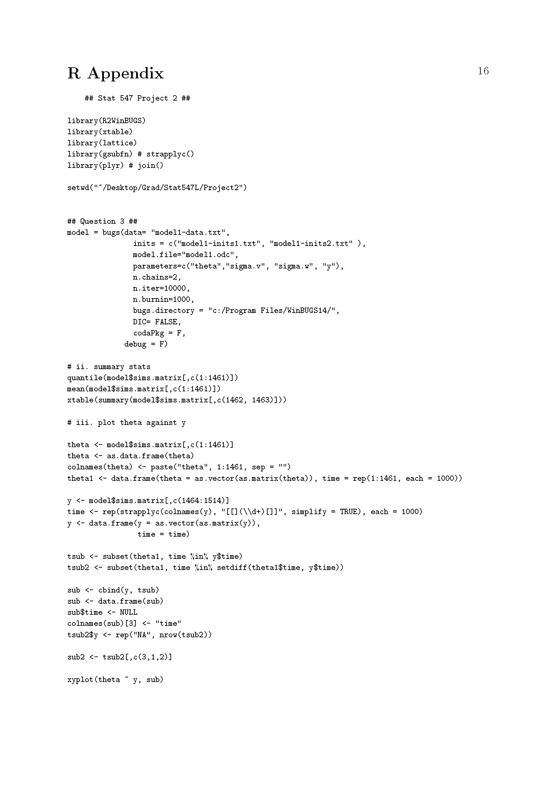
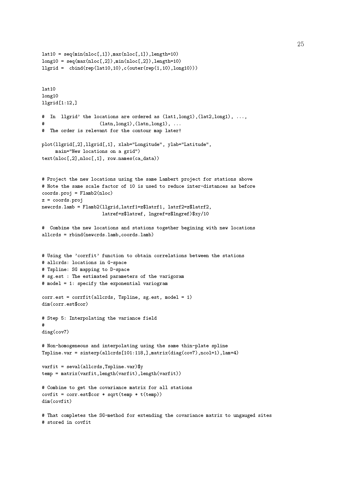

# Project 2_7 

## The projects

## Introduction

This part of the project concerns leukemia, a type of cancer of the blood or bone 
 marrow characterized by an abnormal increase of immature white blood cell.s called "blasts".  It is a broad term covering a spectrum of diseases. Of particular interest are environmental factors 
 that might lead to an increase in its incidence. waller2004applied presents a study that 
 addressed this issue for New York state and developed a spatial dataset that has been much studied since.  
 Here we do an analysis of these data using SAR (simultaneous autoregression) with a newly published CRAN 
 library described below in B1 and code included there as examples.

## The problems

2_7(a). First steps
{verbatim}

  Download the package
library(spdep)
  Study the New York leukemia data file help(NY_data)
  
  {verbatim}

2_7(b). Do a conventional regression analysis of the New York data and briefly interpret the 
findings and state some of the limitations of the analysis. Here is some code that might help.

{verbatim}
example(NY_data)
lm0 <- lm(Z ~ PEXPOSURE + PCTAGE65P + PCTOWNHOME, data=nydata)
summary(lm0)
{verbatim}

2_7(c).  Repeat but this time do a SAR analysis of the data.  (You may use the following scripts below.) 
 Compare your results with those above and give very briefly the conclusions suggested by them.
 
{verbatim}

example(NY_data)
  esar1wf <- spautolm(Z ~ PEXPOSURE + PCTAGE65P + PCTOWNHOME, data=nydata,
     listw=listw_NY, weights=POP8, family="SAR", method="eigen")
    summary(esar1wf)
    
{verbatim}

 
2_7(d).  Repeat this analysis using the conditional autoregressive (CAR) analysis and
 briefly compare your results with the previous ones.
 
## Solutions to Project 2_7
 
{width=120%}
{width=120%}
{width=120%}
{width=120%}
{width=120%}
{width=120%}
{width=120%}
{width=120%}
{width=120%}
{width=120%}
{width=120%}
{width=120%}
{width=120%}
{width=120%}
{width=120%}
{width=120%}
{width=120%}
{width=120%}
{width=120%}

