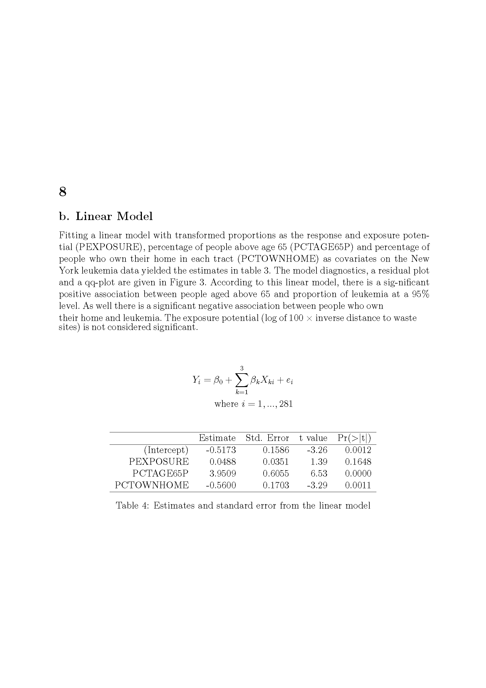
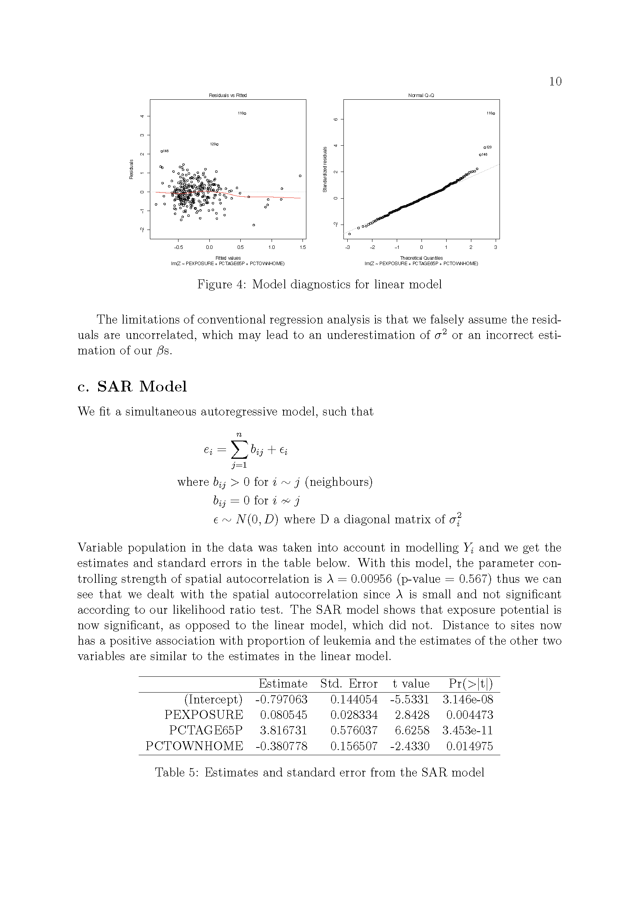
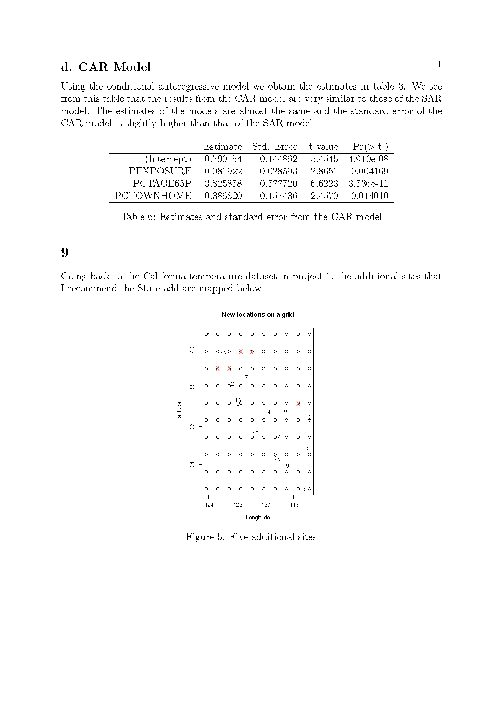
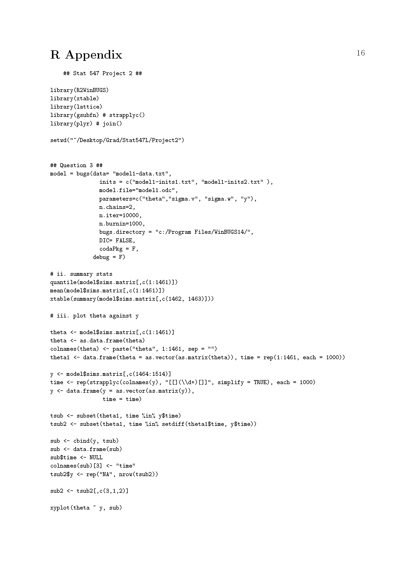

# Project 2_8 
## Introduction

Going back to the California temperature dataset in Project 1, what additional sites would you recommend 
that the State add to the network represented by that dataset to better represent the field, if say the 
state could afford 5 new sites? 

## The problems

Using R-INLA.

2.9(1a). Considering the THM example from lectures and seen in Lab 5, Section 2 Question B: 
Code the THM example of inference on the mean of a Normal distribution as you did in WinBUGS 
for the lab using R-INLA. 
	(1b). Again, obtain summaries of the predictive distribution of a future THM  concentration in the zone. 
	(1c). Calculate the probability that a future THM concentration measured in the zone exceeds 130 $\mu g/l$
	(1d). Compare the results you get using INLA with those you obtained using {\tt WinBUGS}

2.9(2). Considering the Dugongs example seen in Lectures and in Lab 5. Section 3, question A:

2.9(3). Repeat the analyses you performed in  {\tt WinBUGS} for the lab using  {\tt R-INLA}.

2.9(4). Compare the results that you obtain using the two different methods for inference, 
noting any differences you may observe. 

2.9(5). Using the pollution monitored data from London in 2003, take the average concentrations 
over the year of 2003 and fit a spatial model using the SPDE approach seen in lectures. 
You should give summaries of the posterior distributions for all the parameters you use in 
your model and interpret the meaning of the values you find, making particular note of  
the strength of any spatial relationship you observe. 

 
### Solutions for Project 2_8

{width=120%}
{width=120%}
{width=120%}
{width=120%}

