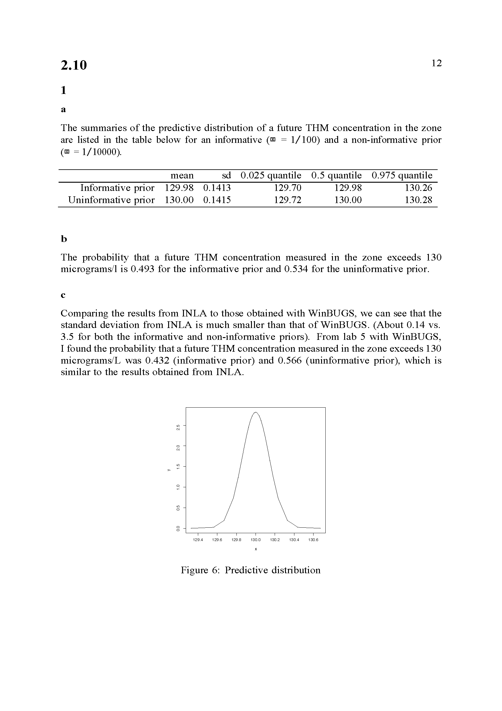
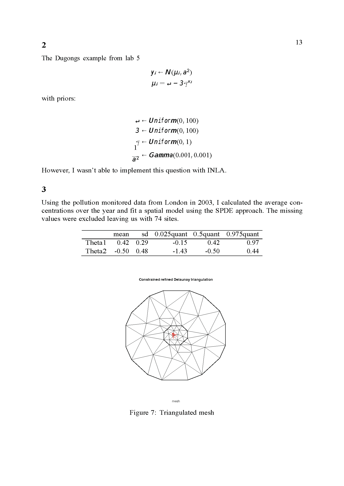
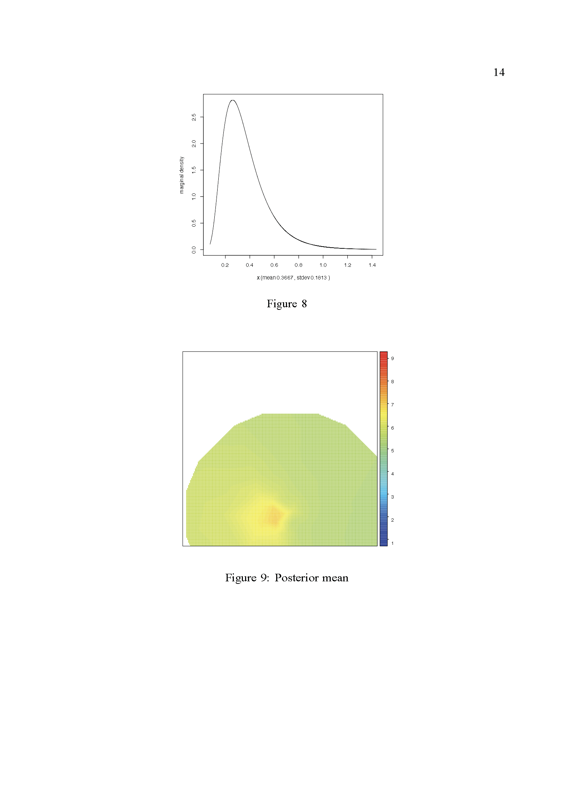
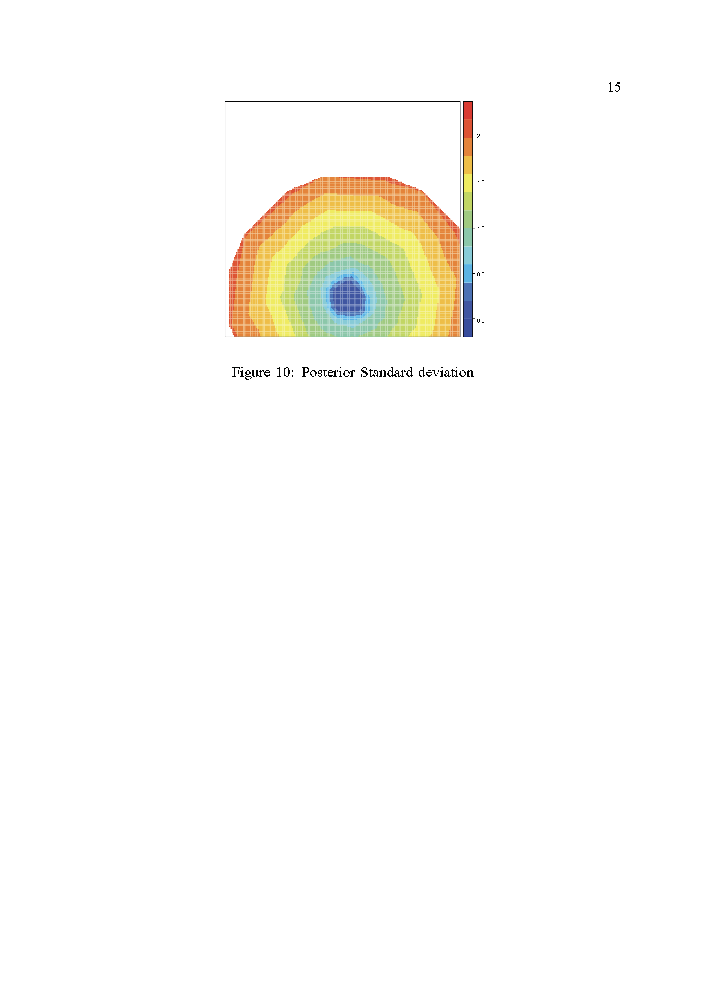
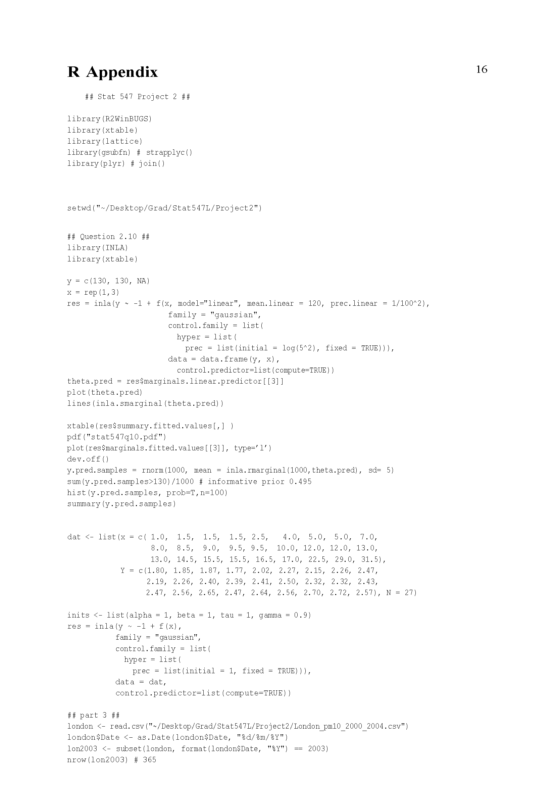
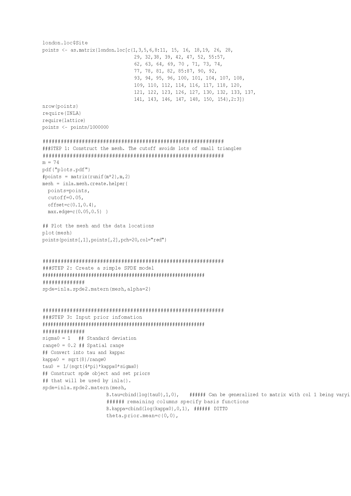
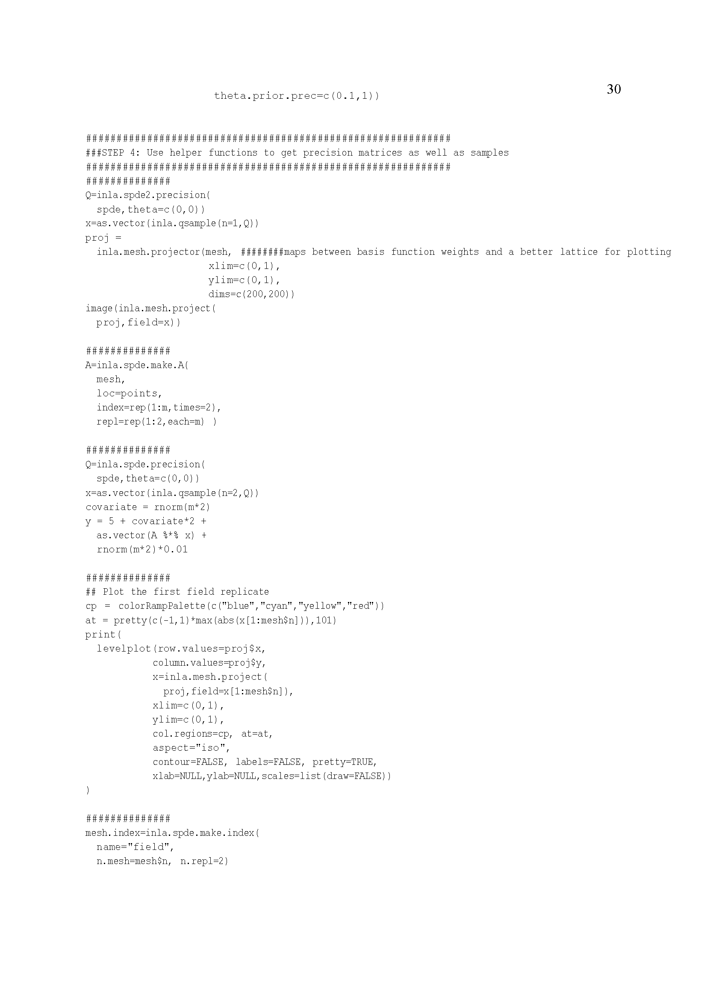
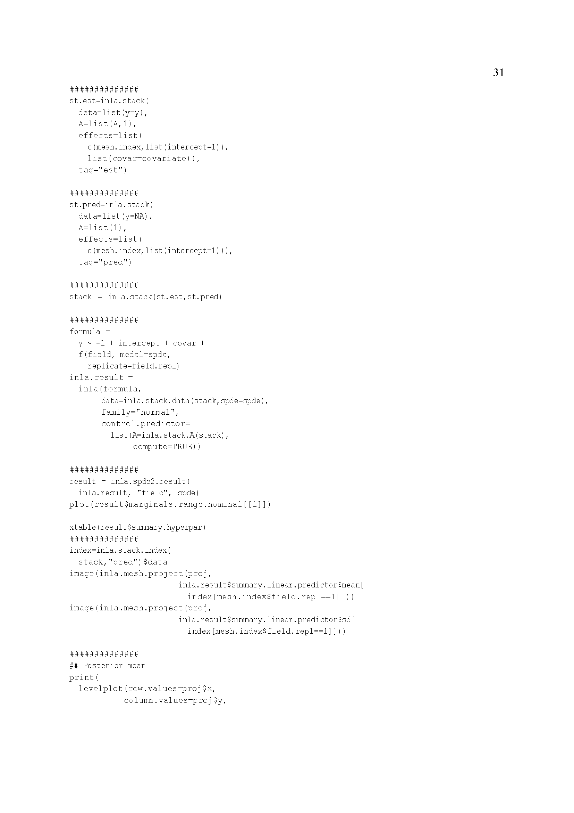
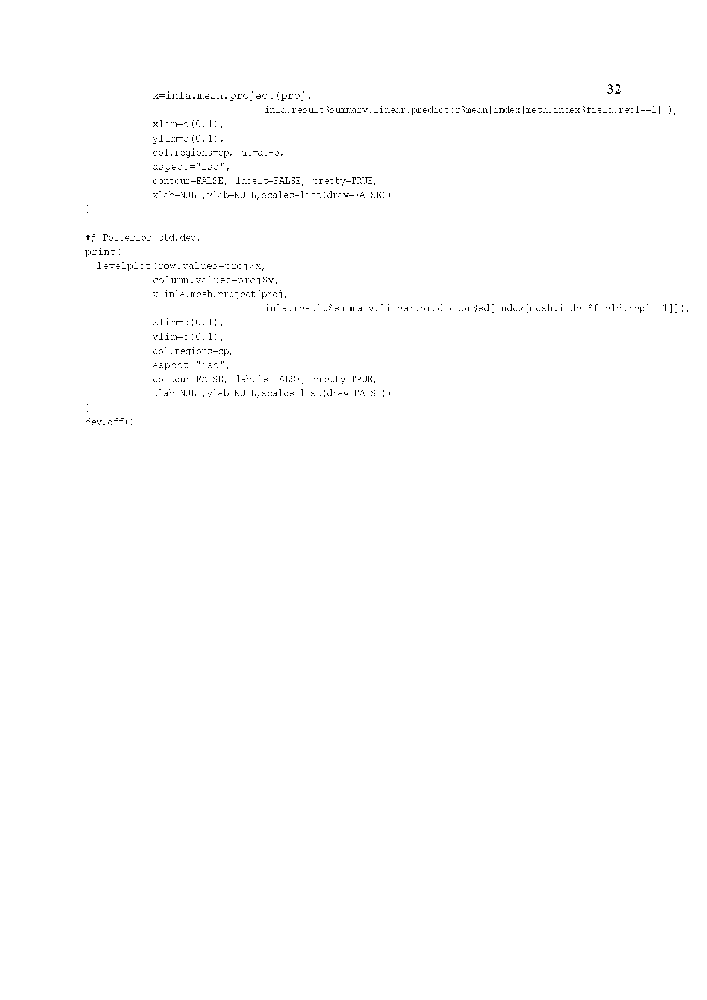

# Project 2_10 

## The problems

Sites, 1,2 and 3 are located along a line: 1 --- 2 ---3.
Each site $i = 1, 2, 3$ has a random responses $Y\_{i}$. Develop a Markov 
random field (MRF) model for these responses, one that involves no Gaussian components. 

2.10(1).  State the neighbourhoods in your model and then the cliques. 

2.10(2).  State the conditional distributions that characterize your MRG and show 
that they yield a proper joint distribution for $(Y\_1,Y\_2,Y\_3)$. 

2.11(3). List the potentials in the model for your joint (Gibbs) distribution.

 
## The Solutions to Project 2_10

{width=120%}
{width=120%}
{width=120%}
{width=120%}
{width=120%}
{width=120%}
{width=120%}
{width=120%}

{width=120%}

{width=120%}