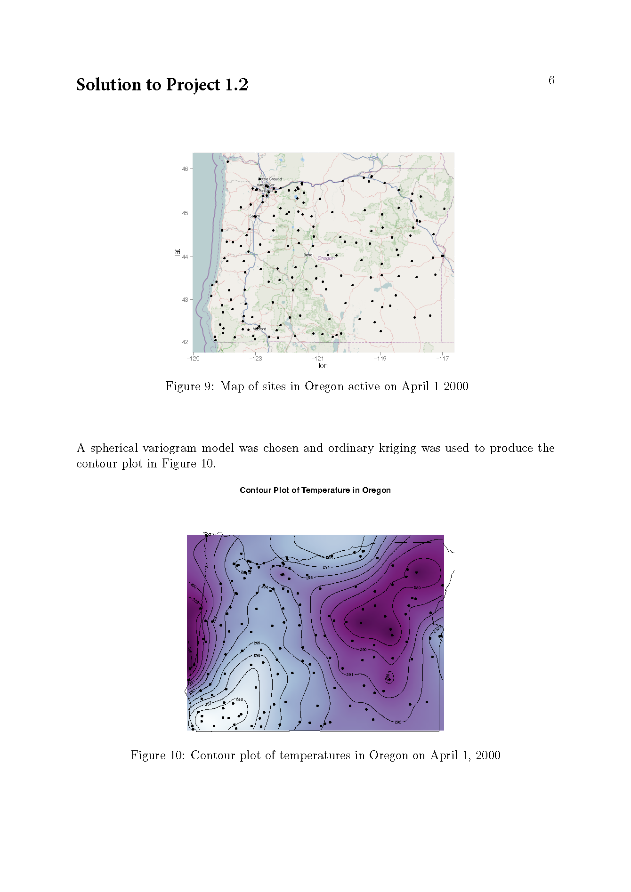
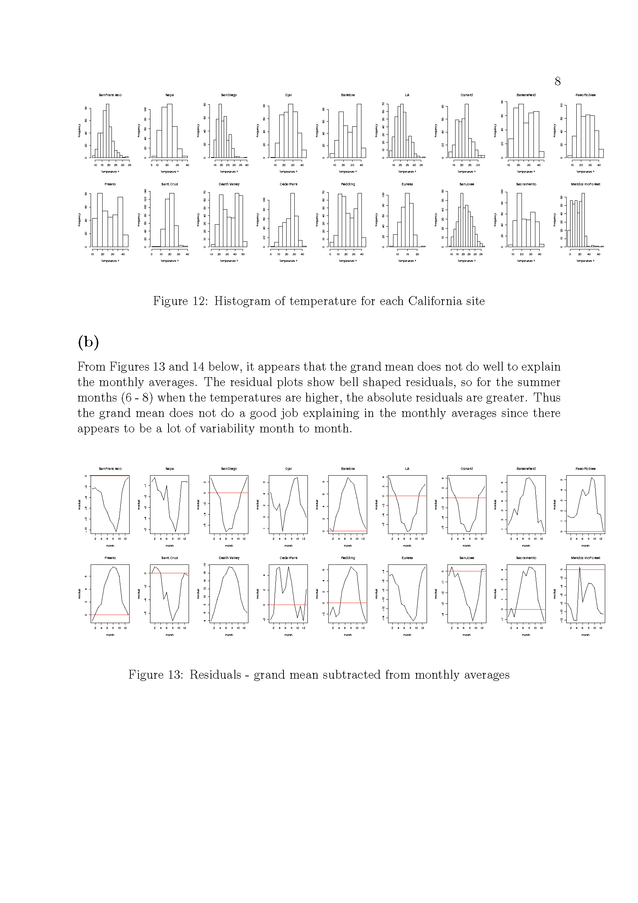
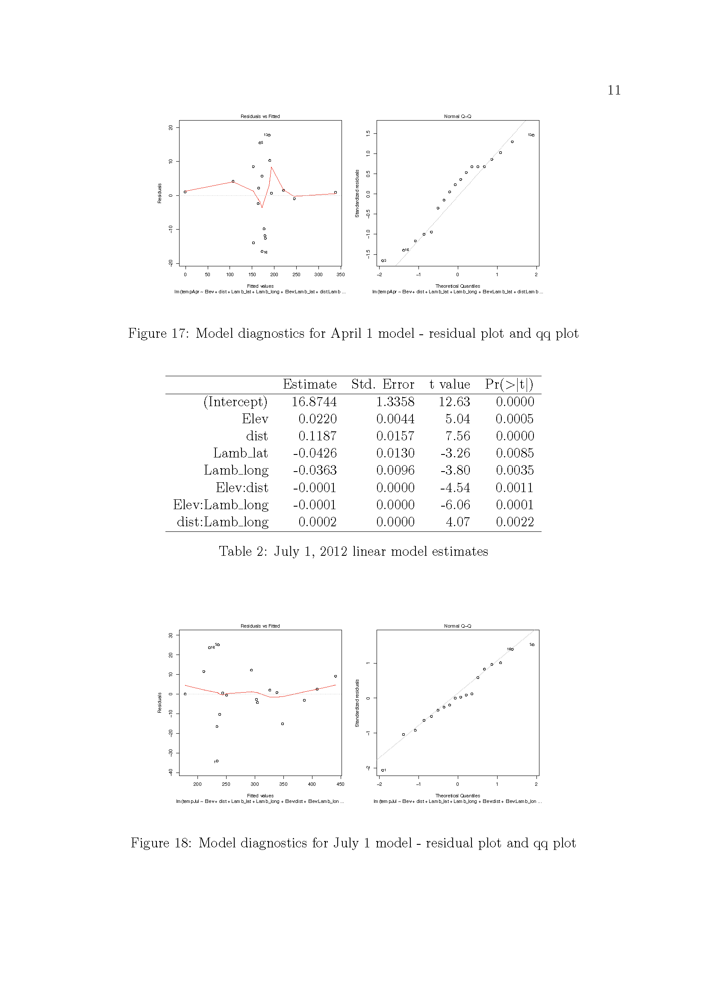
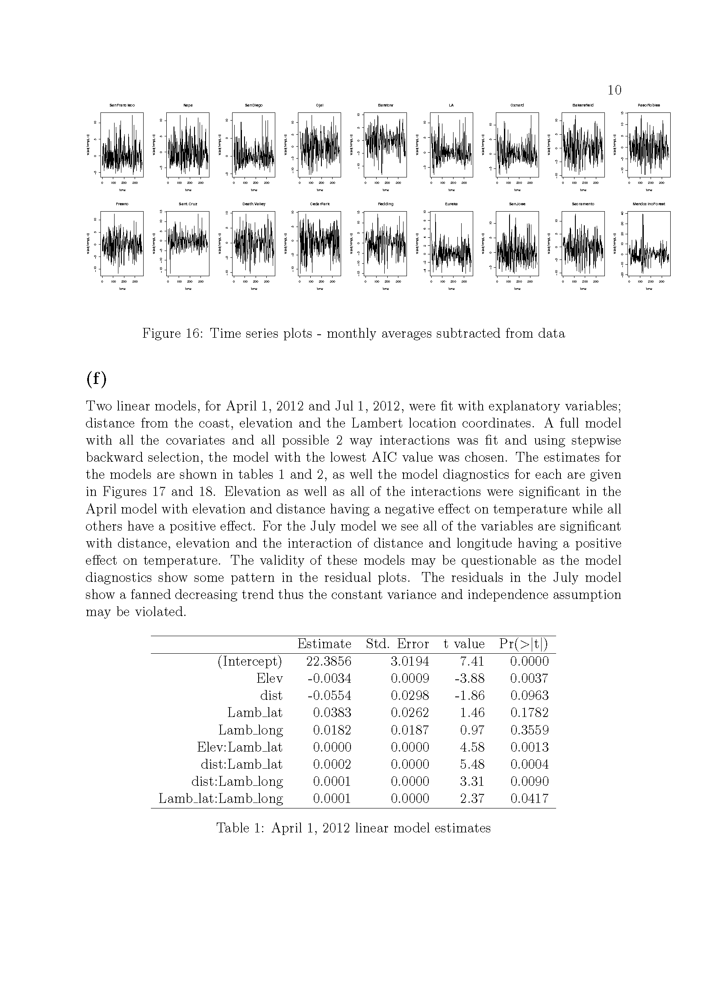
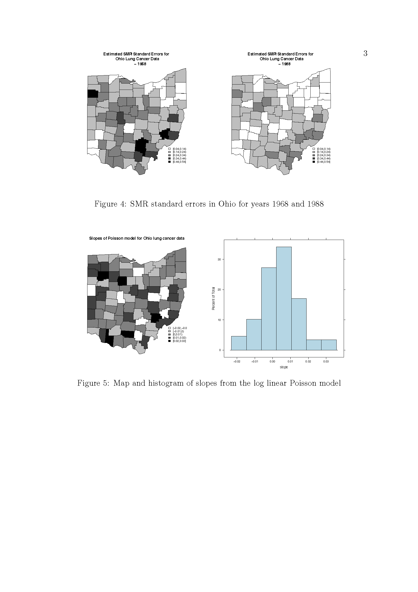

# (PART\*)  Full set of projects

# The projects

## Project1_1

 For this exercise you should perform an analysis of  the spatial distribution of lung cancer in Ohio between 1968-1988.  For each county in Ohio the number of lung cancer deaths and people at risk are given conditioned on county, year, sex, age category and race.

You are to perform both non-spatial and spatial analyses of the data and to compare the results between the different approaches. You should consider the best of dealing with data over multiple years. You should pay special consideration to how the results are most meaningfully presented, both in terms of visual representation and in choosing appropriate methods of summarizing risk.  

### The Problem

The following is a list of pointers to consider:

1. You should clearly state a non-spatial model that is suitable for this analysis and fit it in R. You should describe clearly the results and present them in an informative way. Explain any potential deficiencies in adopting this approach. 

2. Explain why a spatial smoothing approach might be more applicable in this case. Define clearly how an empirical Bayes approach which might be used in this case, explaining clearly what it adds to the analyses.

3. Fit your spatial model using R and present the resulting smoothed relative risks in a meaningful way. 

4. Investigate the effects of the negative binomial dispersion parameter on the smoothed risks you obtain. 

5. Consider alternative outputs which might be useful, in addition to relative risks, and write a report of your findings collating the information gained from all of your analyses.

The OhioMap function on the course webpage can be used as a basis for presenting the results of your analyses. 

### Solution to Project 1.1
{width=120%}

## Project1_2

### The problem

 This exercise is about visualization, important for spatial statistics. R provides a variety of options for plotting data on maps. 
%An individual has described a selection of these in the project folder called ``examples''. 
A vignette can also be found for one of these at
http://cran.r-project.org/web/packages/plotGoogleMaps/
vignettes/plotGoogleMaps-intro.pdf
for one of these packages.  
The data for this part of the exercise were produced by the MURI group at the U of Washington (www.probcast.washington.edu) and provide amongst other things temperature (degrees Kelvin) for a large number of sites in the Pacific NW (with spatial coordinates).  Consider the one labelled  ``phase1.temp.txt'', that gives (for GMT) temperatures (in the "obs" column) for the period January 12, 2000 to June 30, 2000. The data are incomplete since not all sites collect data on the same day.  We will focus on Apr 1, 2000 and stations located in Oregon State. You can use Google Earth (setting spatial coordinates to be given in decimal form) to determine coordinates of sites that lie in Oregon. Those coordinates can also be used to construct a ``bounding box'' for Oregon.

1.Using a package of your choice, plot the points for sites active on Apr 1 on a map of Oregon.

2. Create a regular grid of spatial points that cover Oregon. Using a method of your choice, predict for Apr 1, values of temperature at the points of intersection in your lattice. 

3.  Construct a contour plot of temperature in Oregon on Apr 1, 2000.

4. Add any other informative features to your plot that you deem useful.

The OhioMap function on the course webpage can be used as a basis for presenting the results of your analyses. 

### Solution to Project 1_2

{width=120%}

## Project1_3 

This exercise links with Exercise 14.16 in the text. It concerns temperature data.
The daily data for the project is found in two files:

1. The meta data: metadataCA.txt.  This file gives a number of sites, their elevations above sea level in feet, their geographic coordinates in latitude and longitude, and in two right hand most columns, a reference point's coordinates on the west coast of California linked to the site,  that can be used to learn the site's distance from the ocean.

2. The maximum daily temperature: MaxTempCalifornia.csv.  The maximum daily temperature in 1/10th of a degree Fahrenheit for those sites from Jan 1, 2012 to Dec 30, 2012. 

You may find it convenient to divide the year into different periods, not necessarily based on the ones traditionally used, for example you might divide 2012 into 13 ``months'' of 28 days each by dropping days at the end of the year. This is not compulsory, but you may find it makes your life easier. 

### The problems:

1.3(a).  Explore the data looking at such things as the need to transform it to achieve a Gaussian approximation. Briefly state your findings. 

1.3(b).  Compute ``monthly'' averages of the (possibly transformed) data at each site and their grand mean for each month.  Subtract the latter for each month from the site specific monthly averages for that month to get the residuals. In the report describe observed patterns in these residuals.  How well does the monthly overall mean explain the monthly averages. 

1.3(c).  Next subtract the monthly averages from the (possibly transformed) data. How well do the monthly averages capture the temperature trend (regular component of change) over the year. Report your conclusions.

1.3(d). Convert the geographic coordinates using the Lambert projection. You can find that function the CRAN library, but you will need to install an older version of R to run it.  There you will also get code for the Sampson -- Guttorp warping method as well as a demo based on data seen in Lab 4 for New York State. In these coordinates, Euclidean distance becomes a meaningful measure of separation for any two points.  Work through the Demo. (this part is to worked through on your own in order to answer the subsequent questions - nothing need be submitted)
 
1.3(e). Find the distance of each of the eleven sites from its reference site on the coast and enter the result into an augmented version of the metadata file as another explanatory variable for your analysis. (this part is to worked through on your own in order to answer the subsequent questions - nothing need be submitted)

1.3(f).  For any given day, that distance along with elevation and the (Lambert) location coordinates provide explanatory variables for  temperature.  Ignoring spatial correlation, find a  to the (possibly transformed) temperature data for Apr 1, 2012 and July 1, 2012.  Briefly state your conclusions for each day about such things as significant interactions and model fit, using the usual diagnostic tools.

1.3(g). For each of the two days above, compute the residuals from this fit at each of the sites.  Using standard geostatistical tools, determine if the random field of residuals is stationary.  If not apply the Sampson--Guttorp method to obtain a stationary variogram. Finally ``map'' the temperature field using a mapping tool like kriging on each of the two days. Show your map.

1.3(h). Now repeat the first part of (g) [\emph{for each of the two days above, compute the residuals from this fit at each of the sites}], but this time using the approach in the Demo, including the spatial prediction method given there. Compare the results of with those you found for (g).  Note that the 13 month model suggested above makes adaptation of the approach in the Demo (described in more detail in the LeZidekTutorial found in the resources folder) easier since you can adapt R codes in the demo to the extent possible. 

 
### Solution to Project 1_3

{width=120%}
{width=120%}
{width=120%}
{width=120%}
{width=120%}
{width=120%}
{width=120%}
{width=120%}
{width=120%}
{width=120%}
{width=120%}
{width=120%}
{width=120%}
{width=120%}
{width=120%}
{width=120%}
{width=120%}
{width=120%}
{width=120%}
{width=120%}
{width=120%}
{width=120%}
{width=120%}
{width=120%}
{width=120%}
{width=120%}
{width=120%}
{width=120%}
{width=120%}
{width=120%}

