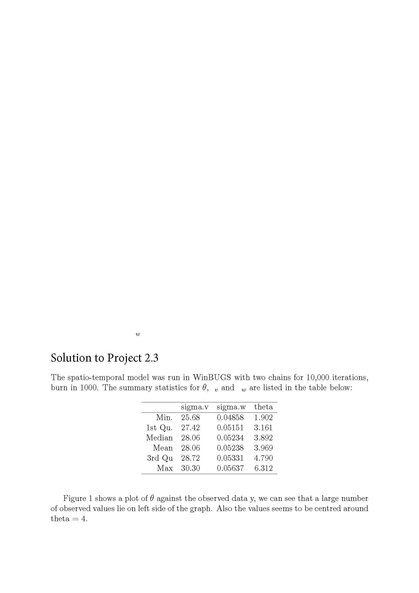
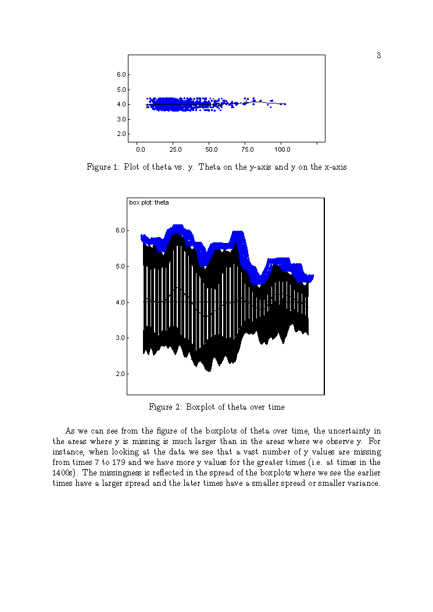
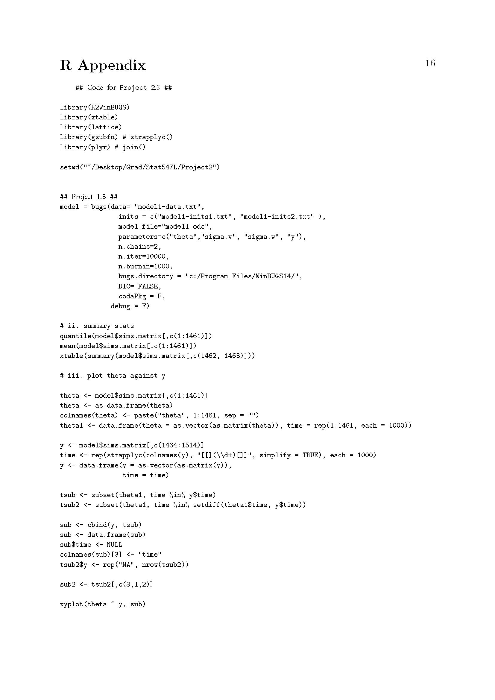
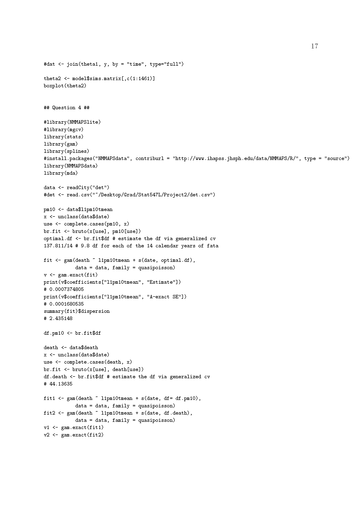

# Project 2_3

## Note
The following involves running the spatio-temporal model originally run in WinBUGS. 
DATA TO BE UPLOADED

## The problems
1.  Open <model1.odc> and load the data <model1-data.odc> and compile the model with two chains. Initial values can be found for two chains in <model1-inits1.odc> and <model1-inits2.odc>.

2.  Run the model for a suitable number of iterations and calculate summary statistics for the posterior distributions of $\theta$, $\sigma.v$ and $\sigma.w$.

3. In R  plot the estimated values $\theta$ against the observed data, y. What do you conclude? Note that you may have to deal with the different lengths of the two series, remember that $\theta$ has no missing values in it. The files are all available in  .txt as well as .odc formats.

4. Plot a suitable summary of the posterior values of $\theta$ (including their uncertainty) against time. What do you conclude about the uncertainty in the values of $\theta$ when the original data is missing?
	
## Solutions for Project 2_3

{width=120%}
{width=120%}
{width=120%}
{width=120%}
