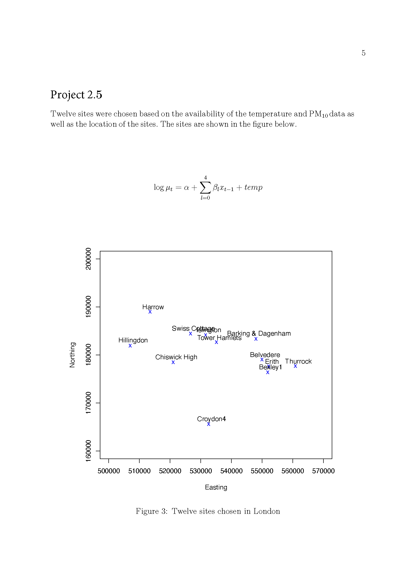
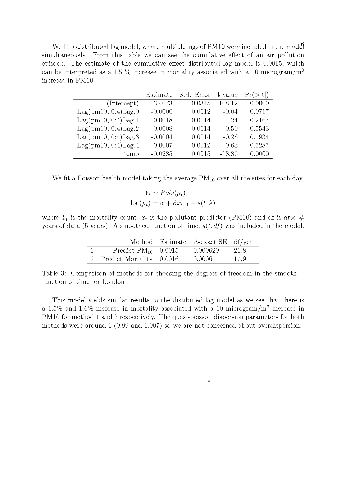

# Project 2_5

## The project

On the associated course GitHub you will find data on the following:

i. Mortality data: daily counts of respiratory mortality in the over 65s from London, 2000-2005.

ii. Daily measures of particulate matter (PM10) from a number of sites from 2000-2004. You may want to `complete the dataset' by obtaining extra pollution data from:

http://uk-air.defra.gov.uk/data/data\_selector 

 
http://www.londonair.org.uk/london/asp/datadownload.asp

Note, you should decide how many sites you want to use in your analysis and make your choice based on data availability, site style (for example roadside, background etc) and other considerations. As a baseline, you might consider the eight sites used in the example used in lectures. 

iii. The locations of the monitoring sites.

iv. Daily measures of temperature for 2000-2005. 

You should fit a suitable spatio-temporal model for the pollution data in WinBUGS and use the results in a health model to assess the effects of PM10 on respiratory mortality. To do this you will have to consider the following.

1. Fitting a simple health model using a single measure of  pollution for each day (for example the mean over all monitoring sites) using only available data (i.e. perhaps using a reduced dataset). You will need to consider appropriate ways of allowing for seasonal patterns and the choice of which lag of $PM_{10}$ to use. 

2. Using the results from your spatio-temporal analysis of PM10 to predict missing values in the pollution dataset

3. Perform a health analysis using the observed data and predicted values of $PM_{10}$. Present your findings in terms of relative risks (with confidence intervals) associated with changes in ten units. Discuss your findings and discuss possibly limitations with your analyses. 

## Solutions for Project 2.5

{width=120%}
{width=120%}

