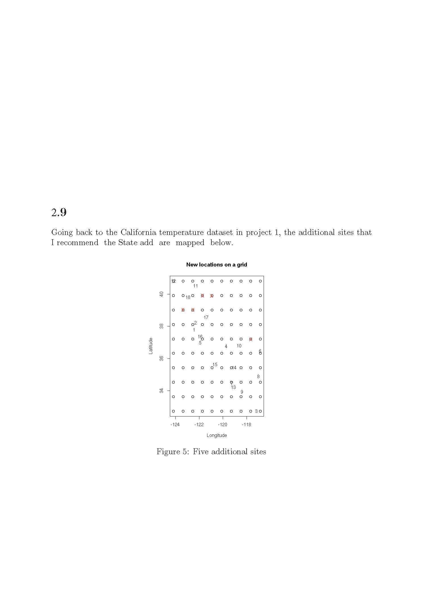
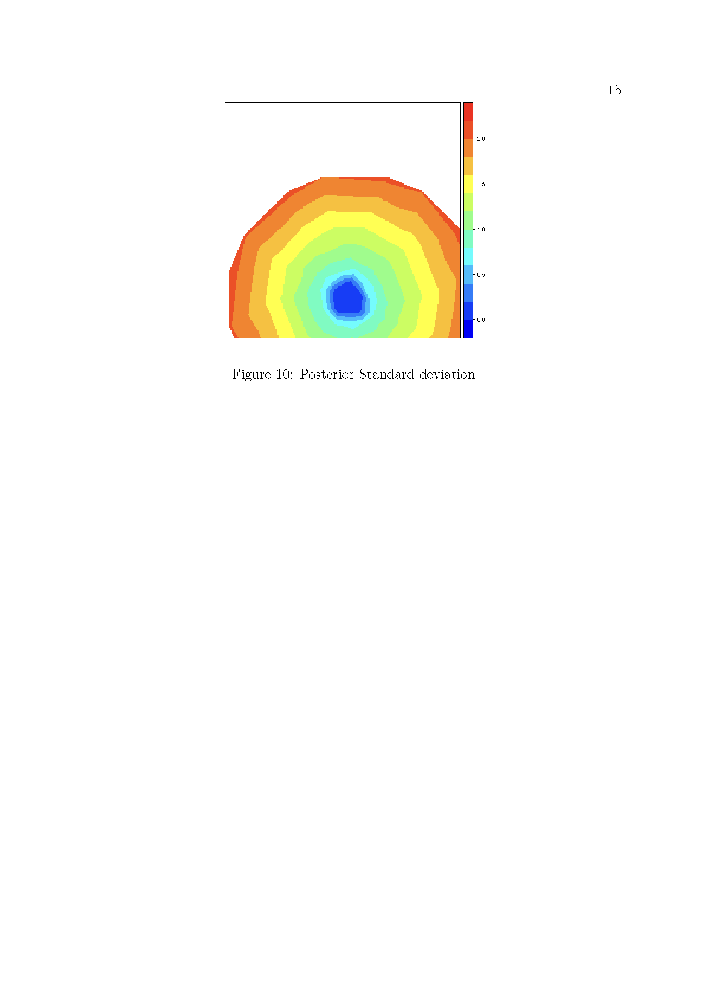
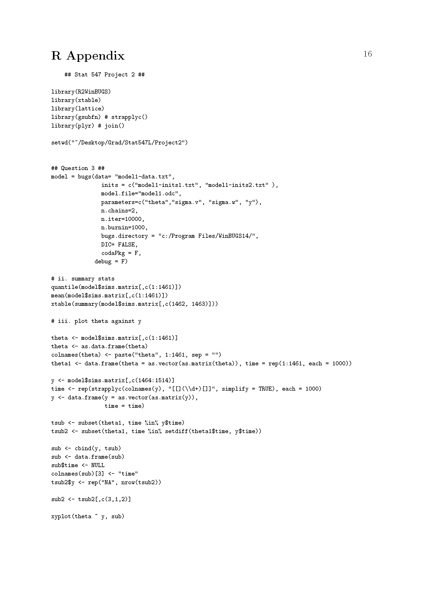
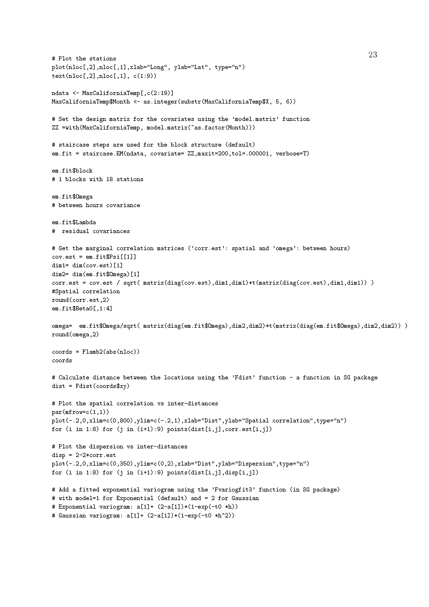
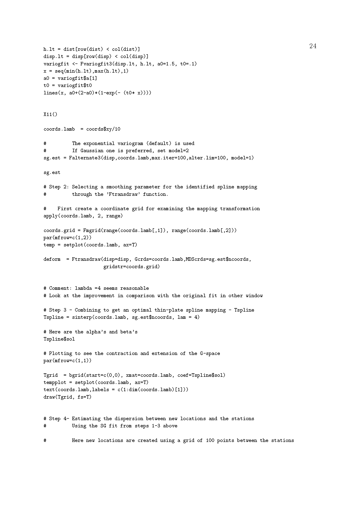
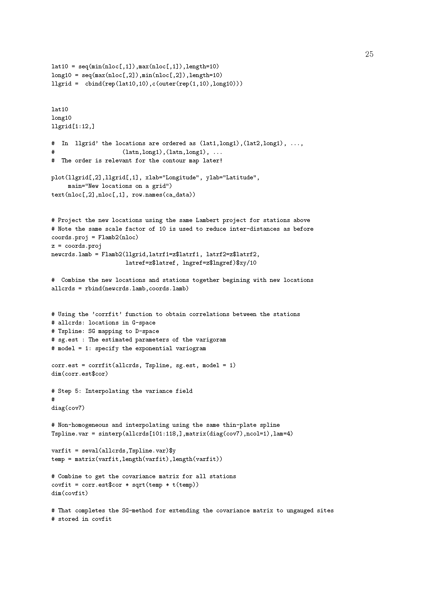
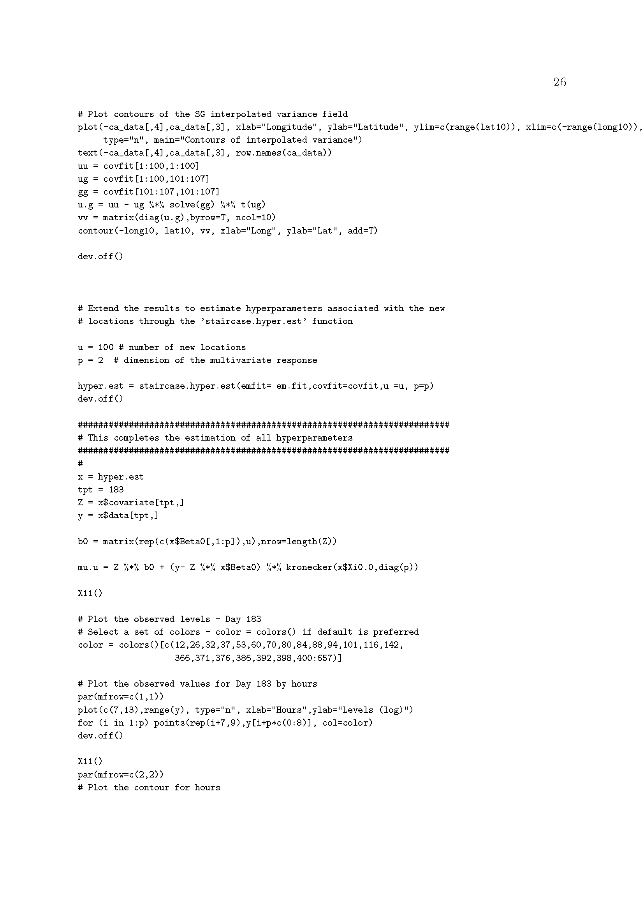
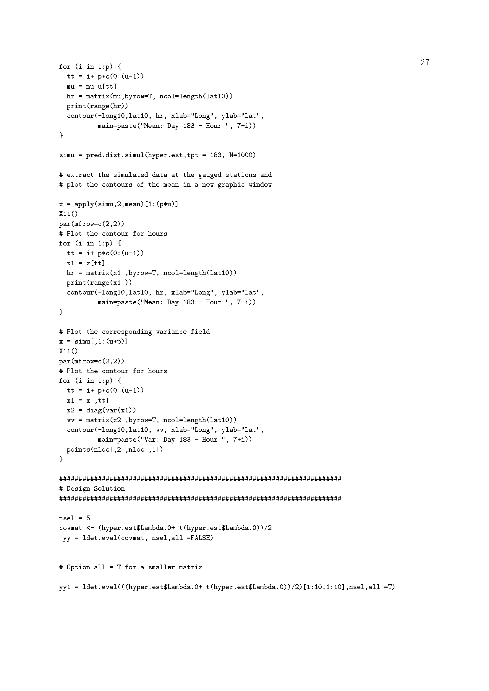

# Project 2_9 

## The project  
Going back to the California temperature dataset in 
Project 2.1, what additional sites would you recommend that the State add to 
the network represented by that dataset to better represent the field, 
if say the state could afford 5 new sites? 

 
### Solutions for Project 2_9

{width=120%}
{width=120%}
{width=120%}

{width=120%}
{width=120%}
{width=120%}

{width=120%}

{width=120%}
